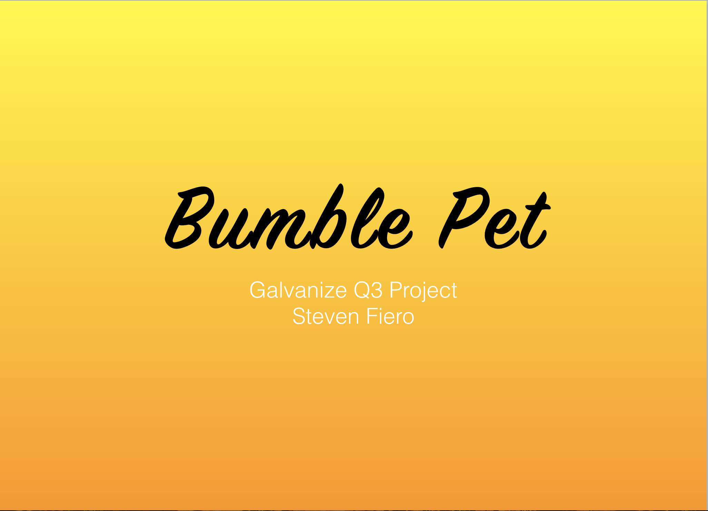

# Bumble Pet
A full stack mobile application that's like Bumble - but for animal shelter pets who need adoption.


## Project Presentation

Click slide below to view presentation details.

[](Bumble-Pet.pdf)


## Build Tools

**Front End:** EJS, Google Materialize

**API to get Pet data:** Petfinder API

**Routes:** Express.js

**SQL queries:** Knex.js

**Back End Database:** PostgreSQL

**Middleware:** Express-Session, bCrypt, morgan, body-parser


## Project Start Commands

Knex make database migration: ```knex migrate:make migrationname```

Knex database migration: ```knex migrate:latest``` or ```knex migrate:rollback```

Knex database seed: ```knex seed:run```

PostgreSQL database: ```psql bumblepet```

List database tables: ```\dt```
Query database table: ```select * from tablename;```
Exit out of database: ```\q```

Start Server: ```nodemon```
